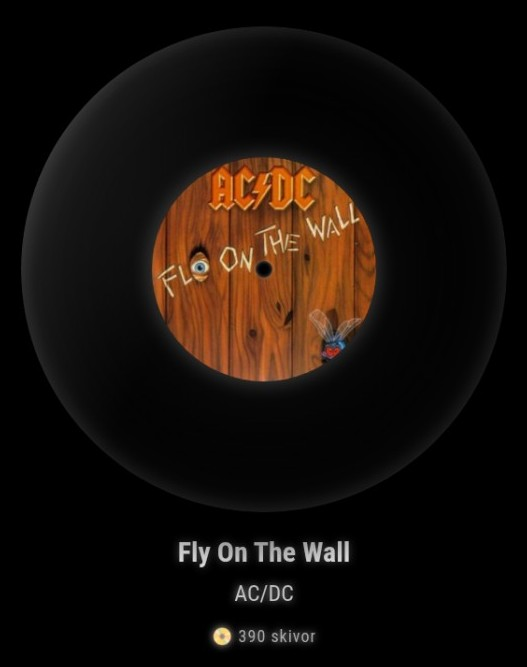
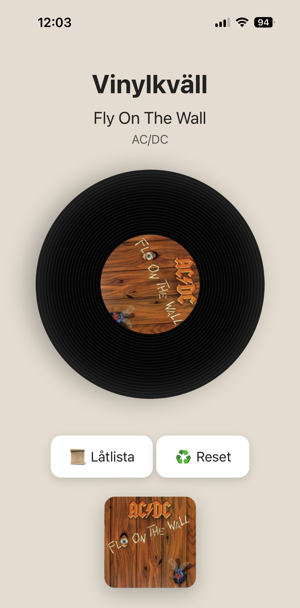

# MMM-SpinTheWheel

A MagicMirror² module that transforms your Discogs vinyl collection into a beautiful spinning vinyl roulette.

MMM-SpinTheWheel loads your Discogs collection, randomly selects a record, displays a realistic spinning vinyl animation, and provides a mobile-friendly remote interface for browsing artwork and track listings.

---

## Features

✅ Loads your complete Discogs collection

✅ Random vinyl selection

✅ Shuffle mode without repeats

✅ Realistic spinning vinyl animation

✅ Touchscreen control on the MagicMirror display

✅ Mouse and VNC-compatible click-and-drag control

✅ Mobile-friendly remote control interface

✅ Track listing viewer

✅ Album artwork viewer

✅ Front and back cover browsing

✅ Shuffle reset function

✅ Multi-language support
- English
- Svenska
- Deutsch

✅ Automatic language detection from MagicMirror

---

## Screenshots

### MagicMirror Module



### Mobile Interface



---

## Installation

Navigate to your MagicMirror modules folder:

```bash
cd ~/MagicMirror/modules
```

Clone the repository:

```bash
git clone https://github.com/dentrass/MMM-SpinTheWheel.git
```

Enter the module directory:

```bash
cd MMM-SpinTheWheel
```

Install dependencies:

```bash
npm install
```

Restart MagicMirror.

---

## Configuration

Add the module to your `config.js` file:

```javascript
{
  module: "MMM-SpinTheWheel",
  position: "middle_center",
  config: {
    username: "YOUR_DISCOGS_USERNAME"
  }
},
```

### Configuration Options

| Option | Description | Default |
|----------|----------|----------|
| `username` | Your Discogs username | Required |

---

## Mobile Interface

MMM-SpinTheWheel includes a built-in mobile web interface.

Open:

```text
http://YOUR_MAGICMIRROR_IP:3001
```

### Mobile Features

- Spin the wheel with touch, mouse or VNC click-and-drag gestures
- View selected album artwork
- Swipe between front and back cover
- View complete track listing
- Reset shuffle history
- Real-time synchronization with MagicMirror

---

## Touch, Mouse and VNC Controls

The vinyl record can be controlled directly from the MagicMirror display using a touchscreen, mouse, or a remote mouse connection through VNC.

Press or click the vinyl, drag it horizontally, and release it to select and spin the next record.

The mobile interface uses the same unified pointer controls, supporting both touch and mouse input. Album artwork can also be changed between the front and back cover by swiping or dragging it horizontally.

No additional configuration is required.

---

## Language Support

The module automatically follows the global MagicMirror language setting.

Supported languages:

| Language | Code |
|-----------|---------|
| English | en |
| Svenska | sv |
| Deutsch | de |

No additional configuration is required.

---

## Discogs API

This module uses the public Discogs API to retrieve collection and release information.

Discogs Developer Portal:

https://www.discogs.com/developers

---

## Dependencies

Installed automatically through:

```bash
npm install
```

Dependencies:

- axios
- express

---

## Privacy

MMM-SpinTheWheel only accesses publicly available information from your Discogs collection.

No personal information is stored or transmitted outside Discogs and your local MagicMirror installation.

---

## Support

If you encounter a bug or have a feature request, please open an issue:

https://github.com/dentrass/MMM-SpinTheWheel/issues

---

## Contributing

Pull requests, bug reports and feature suggestions are always welcome.

---

## Credits

Created by dentrass

Inspired by the joy of rediscovering forgotten records in a vinyl collection.

Special thanks to:

- MagicMirror² Community
- Discogs
- Vinyl collectors everywhere

---

## License

This project is licensed under the MIT License.

See the LICENSE file for details.
